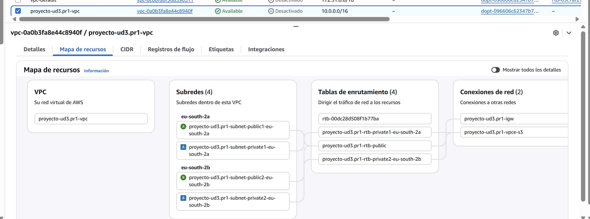

## 🚀 UD3.PR1 (Parte 1): De la Consola a la CLI: Tu Despliegue Canary (HTTP)

### 1. Introducción

En la práctica UD2.PR6, construimos manualmente una arquitectura "Canary" usando la consola de AWS. Este método fue excelente para aprender visualmente, pero es lento, propenso a errores humanos y no es escalable.

El siguiente nivel profesional es la **Infraestructura como Código (IaC)**.

En esta práctica, vamos a abandonar la consola gráfica. Recrearemos **toda** la infraestructura de la UD2.PR6 (SGs, EC2, TGs, ALB, Route 53) usando exclusivamente la **AWS CLI (Command Line Interface)**. Dejaremos la aplicación funcionando de forma insegura por **HTTP (puerto 80)**.

!!! info "Parte 2"
    En la siguiente guía (Parte 2), usaremos la CLI para "parchear" esta infraestructura y migrarla a HTTPS.

### 2. Prerrequisitos

Antes de empezar, asegúrate de tener todo tu entorno local preparado:

1.  **AWS CLI Instalada:** Verifica que tienes la CLI de AWS instalada y funcional.
    * *Documentación Oficial:* [Instalación de la AWS CLI](https://docs.aws.amazon.com/cli/latest/userguide/cli-chap-getting-started.html)
2.  **Visual Studio Code (VS Code):** Nuestro editor de código.
    * *Documentación Oficial:* [Instalación de VS Code](https://code.visualstudio.com/download)
3.  **Git:** Para el control de versiones de nuestro código de infraestructura.
    * *Documentación Oficial:* [Instalación de Git](https://git-scm.com/downloads)
    * *Guía Relacionada:* [Cómo crear un repositorio en GitHub](https://docs.github.com/es/repositories/creating-and-managing-repositories/creating-a-new-repository)
4.  **Tu Dominio (Nominalia):** Necesitas acceso a tu registrador de dominio para el paso manual de delegación de NS.
    * *Documentación Oficial:* [Pág. Oficial: Nominalia](https://www.nominalia.com/)
5.  **VPC Base de Proyecto (Topología de Red):**
    Debes contar dentro de tu entorno de laboratorio con una VPC ya desplegada (puedes reutilizar la de la unidad anterior o crear una nueva con CloudFormation/Terraform) que cumpla estrictamente con la topología mostrada en la imagen inferior:

    * **2 Zonas de Disponibilidad** (ej. `eu-south-2a` y `eu-south-2b`).
    * **Subredes Públicas y Privadas** en cada zona.
    * **Internet Gateway** y **Tablas de enrutamiento** configuradas correctamente.

    

!!! note "Usuario de AWS (Landing Zone / Academy)"
    * **Opción A (Preferida - Landing Zone):** Intentarás la práctica primero con las **credenciales programáticas** (`Access Key ID` y `Secret Access Key`) asociadas a tu usuario de la Landing Zone.
    * **Opción B (Contingencia - Academy):** Si encuentras **errores de permisos** (errores "Access Denied" o similares) en la Landing Zone, detente. **Recoge y documenta todos los errores**. Deberás **escalar estos errores** al equipo de administración.
    * Para poder completar la práctica, cambia a tu entorno de **Laboratorio de AWS Academy**, donde sí tienes los permisos de administrador necesarios.

---

### 3. Paso 1: Configuración del Entorno de Proyecto

1.  **Crear un Repositorio Privado:** Ve a GitHub y crea un nuevo repositorio **privado** llamado `iac-aws-canary-http.[TUSSIGLAS]` (reemplaza `[TUSSIGLAS]` con tus siglas).
2.  **Clonar y Abrir:** Clona el repositorio, entra en la carpeta (`cd iac-aws-canary-http.[TUSSIGLAS]`) y ábrela con VS Code (`code .`).
3.  **Crear Estructura:** Crea los siguientes archivos:

    ```text
    iac-aws-canary-http.[TUSSIGLAS]/
    ├── deploy.sh
    ├── canary.sh
    ├── destroy.sh
    ├── user-data-stable.sh
    └── user-data-canary.sh
    ```

---

### 4. Paso 2: Configurar Credenciales de AWS

1.  Abre tu terminal y ejecuta `aws configure`.
2.  Introduce el `AWS Access Key ID` y `AWS Secret Access Key`.
3.  Define tu región por defecto (ej. `eu-west-1`) y formato de salida (`json`).

---

### 5. Paso 3: Escribir los Scripts de Infraestructura

#### 5.1. Scripts User Data (v1 y v2)

Copia el contenido de los scripts `bash` en los archivos correspondientes.

=== "user-data-stable.sh (v1 - Verde)"
    ```bash title="user-data-stable.sh"
    #!/bin/bash
    yum update -y
    yum install -y httpd
    systemctl start httpd
    systemctl enable httpd
    echo "<body style='background-color:lightgreen;...'><h1>☑ Entorno ESTABLE (v1.0)...</h1>..." > /var/www/html/index.html
    ```
=== "user-data-canary.sh (v2 - Azul)"
    ```bash title="user-data-canary.sh"
    #!/bin/bash
    yum update -y
    yum install -y httpd
    systemctl start httpd
    systemctl enable httpd
    echo "<body style='background-color:powderblue;...'><h1>🚀 Entorno CANARY (v2.0)...</h1>..." > /var/www/html/index.html
    ```

#### 5.2. El Script de Creación (`deploy.sh`)

Este script creará **todo** para HTTP: SGs (solo puerto 80), la zona DNS, las instancias, los 
Este script creará **todo** para HTTP: SGs (solo puerto 80), la zona DNS, las instancias, los TGs, el ALB y el Listener HTTP.

Puedes ver la **explicación detallada** del script o **descargarlo** directamente:

[Ver Explicación :octicons-eye-16:](UD3.PR1-deploy.md){ .md-button }
[Descargar `UD3.PR1-deployConError` :octicons-download-16:](UD3.PR1-deploy-ConErrores.txt){ .md-button }

#### 5.3. El Script de Despliegue (`canary.sh`)

Este script modificará el **Listener 80** (HTTP) para cambiar los pesos.

Puedes ver la **explicación detallada** del script o **descargarlo** directamente:

[Ver Explicación :octicons-eye-16:](UD3.PR1-canary.md){ .md-button }
[Descargar `UD3.PR1-canary.sh` :octicons-download-16:](UD3.PR1-canary.sh){ .md-button }

#### 5.4. El Script de Destrucción (`destroy.sh`)
Este script elimina solo los recursos HTTP creados.

Puedes ver la **explicación detallada** del script o **descargarlo** directamente:

[Ver Explicación :octicons-eye-16:](UD3.PR1-destroy.md){ .md-button }
[Descargar `UD3.PR1-destroy.sh` :octicons-download-16:](UD3.PR1-destroy.sh){ .md-button }

## 🚀 6. Ejecución (Parte 1)

Sigue estos pasos para desplegar y probar tu aplicación.

---

### 💻 1. Preparación de Scripts

Primero, asegúrate de que tus scripts sean ejecutables. En tu terminal local, ejecuta:

```bash
chmod +x deploy.sh canary.sh destroy.sh 
```

### ⚙️ 2. Fases de Despliegue

Sigue esta secuencia para realizar un despliegue canary controlado.

#### Fase 1: Despliegue Inicial (Estable)
1.  **Ejecuta** el script de despliegue:
    `./deploy.sh`
2.  **Acción Manual:** Sigue la instrucción que aparecerá en la terminal para delegar los Name Servers (NS) en tu panel de control de **Nominalia**.
3.  **Prueba:** Espera a que los cambios de DNS se propaguen por completo.
4.  **Verifica:** Visita tu dominio `http://app.aws.tudominio.com`.
5.  **Resultado Esperado:** Deberías ver la página **Verde (Estable)**.

#### Fase 3: Despliegue Completo (0/100)
1.  **Ejecuta** nuevamente el script de canary:
    `./canary.sh`
2.  **Elige** la **opción 2 (0/100)**.
3.  **Prueba:** Recarga la página en tu navegador.
4.  **Resultado Esperado:** Ahora, solo deberías ver la página **Azul (Canary)** en todas las recargas.

---

!!! check "Entregable Parcial"

    1.  Sube todo tu código (los 5 archivos) al **repositorio privado de GitHub**.
    2.  Prepara un **PDF** que incluya:
        * El enlace a tu repositorio privado.
        * Capturas de pantalla de tu terminal mostrando la salida de `deploy.sh` y `canary.sh` (fases 2 y 3).
        * Capturas de pantalla de tu navegador mostrando (con `http://`):
            * La página Verde (Fase 1).
            * La página Azul (Fase 2).
            * La página Azul (Fase 3).
        * **(Opcional)** Si usaste la Landing Zone y falló, añade las capturas de los errores de permisos.